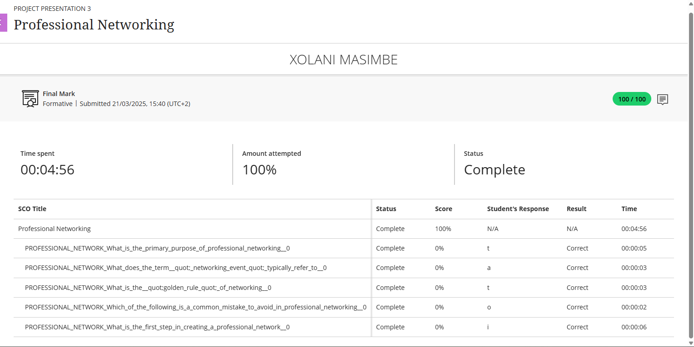
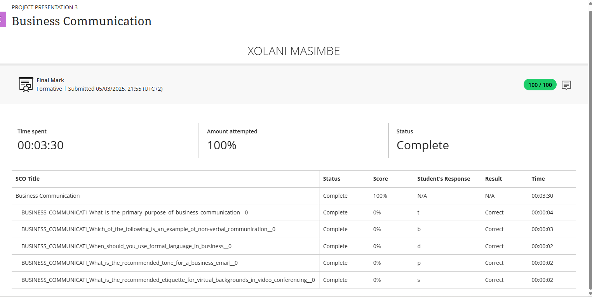
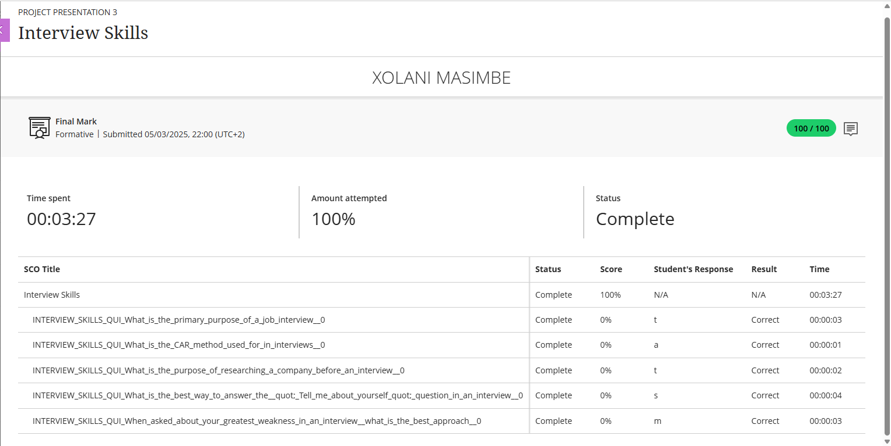
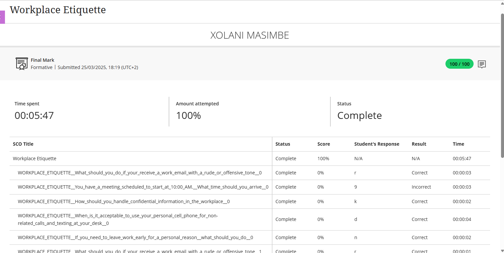

# 💼 Digital Portfolio — Work Readiness (PRP370S)

> "The best way to predict your future is to create it." – Abraham Lincoln

---

## 🌟 Welcome
Hello! I'm a final-year student at **CPUT** completing my **12-month WIL** as a **Full Stack Web Developer Intern** at **Plums System**. This e-portfolio showcases my professional development through evidence and structured reflections.

- 🎓 Programme: ICT Application Development (PRP370S)
- 💻 Role: Full Stack Web Developer Intern @ Plums System
- 📧 Contact: xmasimbe965@gmail.com
- 🔗 LinkedIn: [linkedin.com/in/xolani-masimbe-177890234](https://www.linkedin.com/in/xolani-masimbe-177890234)
- 📄 CV: [Xolani-Masimbe-FlowCV-Resume-20251002.pdf](./Xolani-Masimbe-FlowCV-Resume-20251002.pdf)

---

## 🧭 How to Read This Portfolio
Each rubric item has two parts:
- 🗂️ **Evidence** (artifacts, screenshots, or documents)
- ✍️ **Reflection** using the STAR method  
  *(Situation, Task, Action, Result)*

---

## 🗣️ 1) Business Communication

### 🗂️ Evidence
- 

### ✍️ Reflection (STAR)
- **Situation:** During my internship at Plums System, I had to communicate progress updates to my supervisor and collaborate with team members from different departments.  
- **Task:** My goal was to ensure my written and verbal communication was clear, professional, and concise in daily stand-ups and email correspondence.  
- **Action:** I practiced structured reporting, used professional tone in emails, and learned to adapt my communication style depending on my audience (technical vs non-technical).  
- **Result:** My supervisor commended me for professionalism, and my communication confidence improved significantly during team projects.

> 💬 _“Good communication doesn’t just transfer information—it builds trust.”_

---

## 🤝 2) Interview Skills

### 🗂️ Evidence
- 

### ✍️ Reflection (STAR)
- **Situation:** I participated in a workshop on effective interview techniques to prepare for post-graduation job applications.  
- **Task:** I needed to improve how I present my skills, respond to situational questions, and maintain confident body language.  
- **Action:** I practiced mock interviews with peers, researched common ICT interview questions, and recorded myself to analyze tone and clarity.  
- **Result:** I learned how to answer confidently using the STAR method, highlighting both my technical and interpersonal strengths.

> 🎯 _“Preparation turned my anxiety into confidence.”_

---

## 🎤 3) Mock Interview

### 🗂️ Evidence
- 

### ✍️ Reflection (STAR)
- **Situation:** As part of our Work Readiness programme, I took part in a mock interview with a panel of assessors acting as potential employers.  
- **Task:** My objective was to simulate a real interview and demonstrate my readiness for the workplace.  
- **Action:** I prepared by reviewing my CV, rehearsing my self-introduction, and studying the company background. I focused on maintaining eye contact and giving concise responses.  
- **Result:** The panel complimented my professionalism and encouraged me to elaborate more on project achievements. I gained valuable feedback to refine my real interview strategy.

> 🗣️ _“Every mock interview was practice for the real opportunity.”_

---

## 🌐 4) Professional Networking

### 🗂️ Evidence
- 

### ✍️ Reflection (STAR)
- **Situation:** I wanted to expand my professional network in the ICT industry while completing my internship.  
- **Task:** Build and maintain a strong LinkedIn profile and connect with professionals relevant to my field.  
- **Action:** I optimized my LinkedIn headline, shared my projects, and connected with developers, recruiters, and CPUT alumni. I also participated in GitHub discussions to build credibility.  
- **Result:** My network grew to over 120 connections, and I received engagement on my posts, including positive comments from senior developers.

> 🌐 _“Networking isn’t about collecting contacts—it’s about building meaningful connections.”_

---

## 🧭 5) Workplace Etiquette

### 🗂️ Evidence
- 

### ✍️ Reflection (STAR)
- **Situation:** When I joined Plums System, I had to adapt to professional workplace standards including punctuality, dress code, and collaboration norms.  
- **Task:** To maintain professionalism and positive relationships in the workplace.  
- **Action:** I arrived early for meetings, dressed appropriately, respected deadlines, and practiced good digital etiquette on platforms like Slack and Teams.  
- **Result:** My colleagues described me as reliable and respectful. These habits strengthened my reputation and team trust.

> 🤝 _“Professionalism is shown through consistency, not titles.”_

---

## 📄 6) CV Creation & Submission

### 🗂️ Evidence
- 📄 [Updated Resume PDF](./Xolani-Masimbe-FlowCV-Resume-20251002.pdf)
- ✉️ Optional: Screenshot of submission confirmation or recruiter response

### ✍️ Reflection (STAR)
- **Situation:** My previous CV was outdated and didn’t fully reflect my growth as a developer.  
- **Task:** Redesign it to align with modern standards and emphasize my technical projects and internship experience.  
- **Action:** I used FlowCV to create a clean, responsive layout. I included GitHub links, relevant coursework, and professional branding. I also submitted it to selected internship and graduate programmes.  
- **Result:** The new CV received positive feedback from mentors and improved my professional presentation across LinkedIn and GitHub.

> 📑 _“A CV isn’t just a summary—it’s the first impression of your story.”_

---

## 🏁 Final Reflection
This digital portfolio documents my personal and professional growth through real experiences, reflection, and self-awareness. Each activity strengthened my readiness for the ICT industry—helping me grow from a student into a professional developer.

> ⭐ _“I don’t just want a job—I want a journey where I grow, contribute, and inspire.”_
